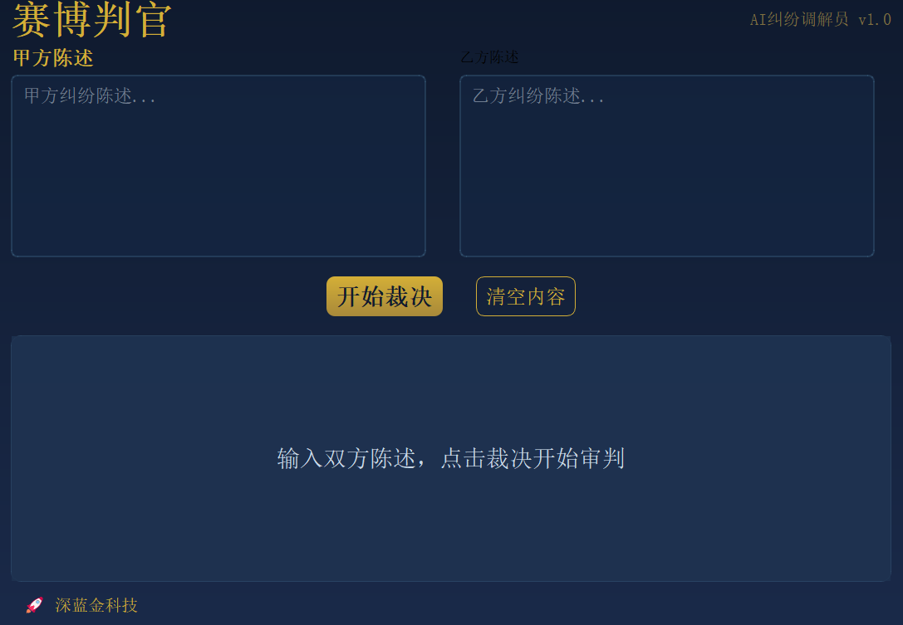
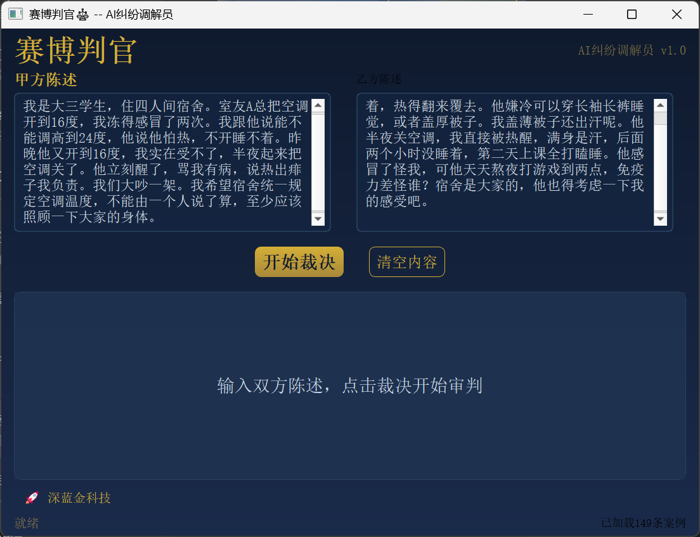
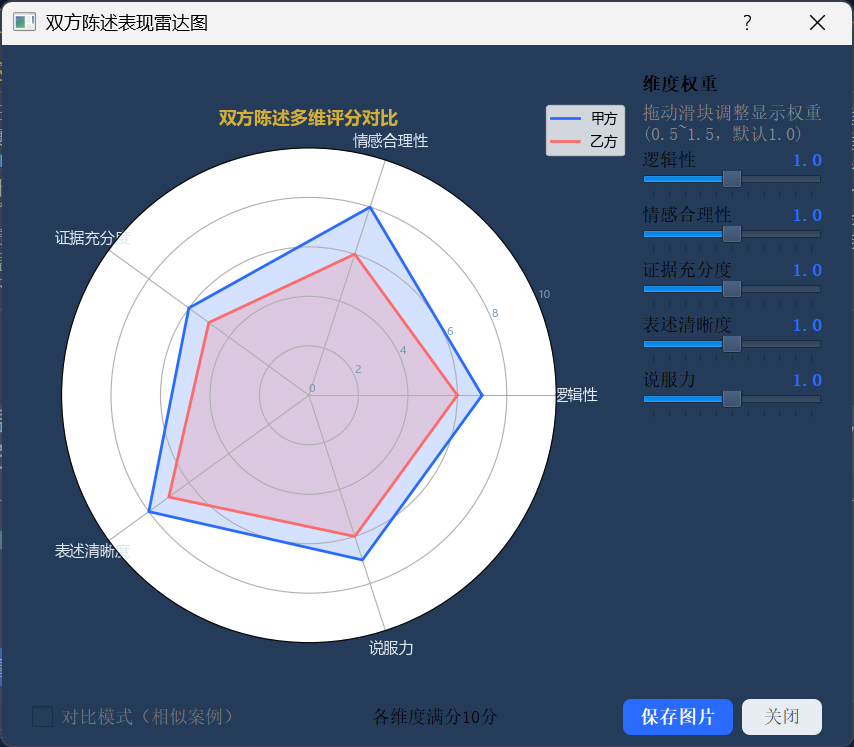
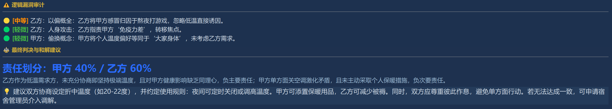
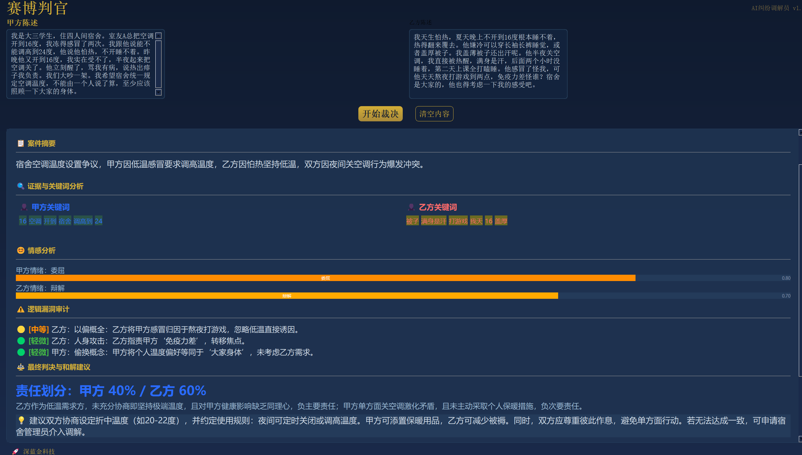

# ⚖️ 赛博判官 — AI纠纷调解Agent

> 输入双方陈述，输出一纸判决

## 📖 项目简介

赛博判官是一个基于大语言模型的AI纠纷调解Agent。用户分别输入甲方和乙方的纠纷陈述，系统自动分析双方立场，输出结构化的"判决书"，包含案件摘要、证据分析、逻辑漏洞审计、最终判决与和解建议，并生成雷达图对比双方陈述表现。

## ✨ 功能特性

- 🧠 **AI Agent工作流**：情感分析 + 关键词提取 + 相似案例检索 + LLM综合推理
- 🎨 **PyQt5可视化界面**：输入陈述、查看判决书、切换主题、导出报告
- 📊 **雷达图分析**：五维对比（逻辑性/情感合理性/证据充分度/表述清晰度/说服力）
- 🎭 **四种主题配色**：暗夜霓虹 / 极简白金 / 深蓝金科技 / 墨绿金复古
- 📄 **导出报告**：Markdown格式导出判决书+雷达图
- 🏗️ **149条知识库**：TF-IDF检索相似案例

## 🛠️ 技术栈

| 技术 | 用途 |
|------|------|
| Python 3.10+ | 主语言 |
| PyQt5 | 桌面GUI |
| DeepSeek API | LLM推理 |
| pandas / jieba | 数据处理与分词 |
| scikit-learn | TF-IDF检索 |
| matplotlib | 雷达图可视化 |

## 🚀 快速开始

### 1. 克隆项目

```bash
git clone https://github.com/你的用户名/cyber_judge.git
cd cyber_judge
```

### 2. 安装依赖

```bash
pip install -r requirements.txt
```

### 3. 配置API Key

复制 `.env.example` 为 `.env`，填入你的DeepSeek API Key：

```bash
cp .env.example .env
```

### 4. 运行程序

```bash
python run.py
```

## 📁 项目结构

```
cyber_judge/
├── data/                # 纠纷案例数据（149条）
├── src/
│   ├── gui/             # PyQt5界面（主窗口/判决书/雷达图）
│   ├── tools/           # Agent工具（情感/关键词/检索）
│   └── utils/           # 配置与常量
├── resources/           # 图标等资源文件
├── docs/                # 报告与PPT
├── scripts/             # 工具脚本
├── run.py               # 程序入口
├── requirements.txt     # 依赖清单
└── README.md            # 项目说明
```

## 📸 截图

### 主界面（现已支持四种主题）



### 雷达图


### 逻辑漏洞审计


### 判决书展示


## 🤝 贡献

欢迎提交Issue和Pull Request。

## 📄 许可证

MIT License
